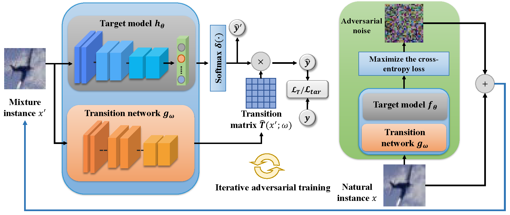

<div align="center">  

# Modeling Adversarial Noise for Adversarial Training
[](https://proceedings.mlr.press/v162/zhou22k/zhou22k.pdf)

</div>

The implementation of [Modeling Adversarial Noise for Adversarial Training](https://proceedings.mlr.press/v162/zhou22k/zhou22k.pdf) (ICML 2022).

Deep neural networks have been demonstrated to be vulnerable to adversarial noise, promoting the development of defense against adversarial attacks. Motivated by the fact that adversarial noise contains well-generalizing features and that the relationship between adversarial data and natural data can help infer natural data and make reliable predictions, in this paper, we study to model adversarial noise by learning the transition relationship between adversarial labels (i.e. the flipped labels used to generate adversarial data) and natural labels (i.e. the ground truth labels of the natural data). Specifically, we introduce an instance-dependent transition matrix to relate adversarial labels and natural labels, which can be seamlessly embedded with the target model (enabling us to model stronger adaptive adversarial noise). Empirical evaluations demonstrate that our method could effectively improve adversarial accuracy.


<p float="left" align="center">
 
<figcaption align="center">

The illustration of our proposed Modeling Adversarial Noise-based method (MAN). $\boldsymbol{y}$ denotes the ground-truth label $y$ in the form of a vector. $\boldsymbol{\hat{y}^{\prime}}$ and $\boldsymbol{\hat{y}}$ denote the probability of the estimated mixture label $\hat{y}^{\prime}$ and the probability of the inferred natural label $\hat{y}$, respectively. That is, $\boldsymbol{\hat{y}^{\prime}}=\delta(h_{\theta}(x^{\prime}))$ and $\boldsymbol{\hat{y}}=\boldsymbol{\hat{y}^{\prime}} \cdot \widehat{T}(x^{\prime};\omega)$. 
</figcaption>
</p>


## Requirements
- This codebase is written for `python3` and 'pytorch'.
- To install necessary python packages, run `pip install -r requirements.txt`.

- ## Experiments
### Data
- Please download and place the dataset into the 'data' directory.


### Training
To train the standard AT model

```
python train_standard.py --model_dir 'your checkpoint directory'
```

To train the MAN-based model

```
python train_standard_man.py --model_dir 'your checkpoint directory'
```


### Test
To test the learned model using general attacks

```
python test_comparison.py --model_dir 'your checkpoint directory' (including PGD, Autoattack, DDN attack, etc.)
```


To test the learned model using adaptive attacks

```
python test_adaptive.py --model_dir 'your checkpoint directory'
```


## License and Contributing
- This README is formatted based on [paperswithcode](https://github.com/paperswithcode/releasing-research-code).
- Feel free to post issues via Github. 


## Reference
If you find the code useful in your research, please consider citing our paper:

<pre>
@inproceedings{zhou2022modeling,
  title={Modeling Adversarial Noise for Adversarial Training},
  author={Zhou, Dawei and Wang, Nannan and Han, Bo and Liu, Tongliang},
  booktitle={International Conference on Machine Learning},
  pages={27353--27366},
  year={2022},
  organization={PMLR}
}
</pre>
